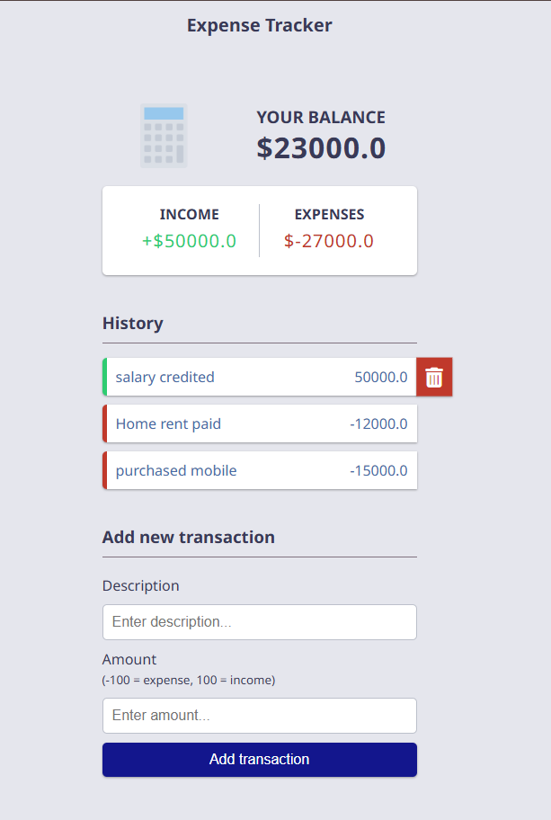

<h1 align="center">💰 Expense Tracker</h1>
<p align="center">
  A simple web application to track income & expenses, built with Django & MySQL.<br>
  Manage your finances with ease — add transactions, categorize them, and view balance history.
</p>

<p align="center">
  
  
  
  
</p>

---

## 🚀 Overview
Managing personal finances has become increasingly important, whether you're saving for a vacation, planning for retirement, or simply staying within a budget.  
This **Expense Tracker** application helps you log and categorize your expenses while keeping track of your overall balance.

---

## ✨ Features
- 🔑 **User Authentication**: Register, login, and manage accounts securely.  
- 💵 **Expense Management**: Add, edit, delete, and view expenses.  
- 📊 **Categories**: Organize expenses by category for better analysis.  
- 📱 **Responsive UI**: Works across devices for accessibility.  
- 🗄️ **Database Integration**: Stores data with MySQL via Django ORM.  

---

## 📸 Screenshots
<p align="center">
  
  
  
</p>

---

## 🛠 Tech Stack
- **Frontend**: HTML, CSS (template adapted from CodePen)  
- **Backend framework**: Django
- **Pogramming language**: Python
- **Database**: MySQL (via XAMPP)  
- **Version Control**: Git, GitHub  
- **Other Tools**: Django ORM, Admin Pannel  

---

## ⚙️ Installation & Setup

### 1. Clone the repository
     ```bash
     git clone <https://github.com/nameisrahul/EXPENSE-TRACKER.git>
     ```
 
  2. Create a virtual environment
     ```bash
     python -m venv venv
     ```
     Activate it
     - Windows
       ```bash
       venv\Scripts\activate
       ```
     - Mac
       ```bash
       source venv/bin/activate
       ```
 
  3. Install Dependencies
     change it to the project directory
     ``` bash
     cd EXPENSE-TRACKER
     ```
    
  - open the code in VScode or any IDE's 
 
  4. Apply migrations
     ```bash
     python manage.py makemigrations
     python manage.py migrate
 
  5. Run the Development Server
     ``` bash
     python manage.py runserver
     ```
  Your app will be available at http://127.0.0.1:8000/


